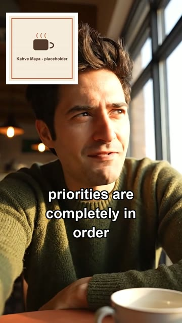
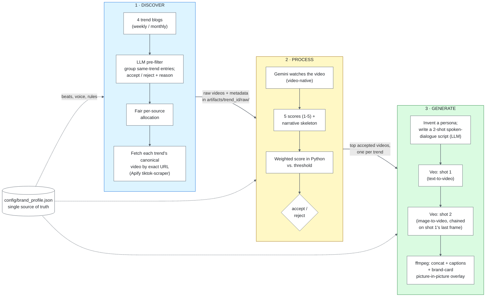

# Trend-to-Ad Pipeline

Turn live TikTok trends into on-brand ad concepts for a (fictional) specialty cafe:
**discover -> judge -> script**, with an optional paid step that renders the scripts as short vertical videos.
Every stage writes plain files, so any output can be traced back to the trend it came from.

> **Kahve Maya is a fictional brand invented for this demo** — a calm, slightly upscale specialty cafe in
> Istanbul built around the ritual of time. It is not a real business. The pipeline is brand-agnostic: swap
> [`config/brand_profile.json`](config/brand_profile.json) to re-target it (schema: [`config/brand_profile.schema.md`](config/brand_profile.schema.md)).

| Stage | What it does | Entry point | Detail |
|---|---|---|---|
| **Discover** | Four editorial trend blogs -> LLM pre-filter (group, accept/reject with reasons) -> fair allocation -> fetch each trend's canonical example video | `run_discover.py` | [DISCOVER.md](DISCOVER.md) |
| **Process** | Gemini watches every video, extracts its structure, scores it on a 5-criterion rubric; the weighted accept/reject decision is computed in Python | `run_process.py` | [PROCESS.md](PROCESS.md) |
| **Generate** | Top trends -> script (invented persona + spoken dialogue, brand named inside the joke) -> two Veo clips -> ffmpeg assembly with captions and a picture-in-picture brand card | `run_generate.py` | [GENERATE.md](GENERATE.md) |
| **All three** | Orchestrator: resumes from disk state, gates between stages, reports progress and cost | `run.py` | this file |

**See it first:** a 12-second ad this pipeline produced end to end for the fictional brand (highest-scoring trend of a live run; one Veo `fast` render; ~$1.58 for the whole run):

<p align="center"><a href="examples/kahve_maya_sample_ad.mp4"></a><br/><a href="examples/kahve_maya_sample_ad.mp4"><b>▶ Watch the sample ad (examples/kahve_maya_sample_ad.mp4)</b></a></p>

The person is AI-generated and invented (the video carries Google's SynthID watermark); the brand card in the corner is a neutral placeholder. The exact script
and manifest that produced it are in [`examples/`](examples/). Details and caveats in [Results](#results).

---

## Quick start (offline first, nothing here spends money)

**Requirements:** Python 3.10+, `ffmpeg` and `ffprobe` on `PATH`.

```bash
pip install -r requirements.txt
python -m unittest discover -s tests -t .     # 25 offline tests: brand profile, prompts, validators, scoring
python -m agents.brand                        # validate config/brand_profile.json and print the rendered contexts
python run.py --dry-run                       # show what would run and what is stale; spends nothing
```

In a fresh clone the dry run reports all three stages as `RUN` (nothing is on disk yet; raw videos are never committed).

**Paid runs** need two different keys (different providers): a **Gemini** key (all stages; Veo needs a billing-enabled key)
and an **Apify** token (Discover only).

```bash
cp .env.example .env                          # fill in GEMINI_API_KEY and APIFY_API_TOKEN
python run.py --top-n 1 --max-trends 6 --model-tier fast --api-key <GEMINI_KEY>   # one ad, ~$1.6 (the run behind the sample above)
python run.py --api-key <GEMINI_KEY>          # defaults: top 3 trends; resumes, skips what is already done
```

What `run.py` does: calls each stage's own entrypoint in-process (no stage logic is duplicated); decides from what is *really on disk*
whether a stage is complete (and treats analyses scored for a different brand as not done); stops with exit code 3 and a message
when Discover leaves fewer than `--top-n` usable trends (including a silent fixture fallback) or Process accepts fewer than `--top-n`
distinct trends; and reports Apify spend (measured) and Gemini/Veo spend (estimated, the APIs return no cost).
`--force [stage ...]` redoes stages, `--dry-run` plans.

| Flag | Default | What it does |
|---|---|---|
| `run_generate.py --model-tier` | `standard` | Veo tier: `lite` $0.05/s, `fast` $0.10/s, `standard` $0.40/s |
| `run.py --model-tier` | `fast` | forwarded to Generate |
| `--script-only` | off | stop after scripts, before any Veo spend |
| `--force` | off | regenerate and reassemble; without it valid existing output is never redone |

---

## Architecture



*The diagram was read for syntax, not rendered; GitHub renders Mermaid natively.*

### How trends are found

Editorial TikTok-trend blogs (three weekly, one monthly) already curate what is trending and link to a concrete example video for
each trend. Discover scrapes those lists, feeds the **raw, undeduplicated** list to one text-only Gemini call that groups entries
describing the same trend across blogs and accepts or rejects each group *with a written reason* (before any video is downloaded),
caps the accepted groups with a round-robin across sources, and fetches each group's canonical video by its **exact URL**.
Rejections are a first-class output (`data/trends/{week}/prefilter_result.json`).

### The scoring rubric (accept/reject math)

Process sends each video to Gemini natively (the model watches it, audio included) and asks for a structured analysis: what literally
happens, the same video stripped to its transferable *narrative skeleton*, the hook type and when it lands, and five scores. **Every
score is 1-5 and 5 is always the favourable end**, including `licensing_safety` (5 = nothing to clear). The weighted score and the
verdict are computed in Python from [`config/scoring_weights.json`](config/scoring_weights.json), never trusted from the model, so
re-weighting re-scores every stored video for free.

| Criterion | Weight | Brand-dependent? |
|---|---|---|
| `narrative_transferability` | 0.30 | no |
| `brand_fit` | 0.25 | **yes** — judged against the beats in `brand_profile.json` (for Kahve Maya: rush-to-calm, the slow ritual, the small luxury) |
| `hook_strength` | 0.20 | no |
| `production_feasibility` | 0.15 | no |
| `licensing_safety` | 0.10 | partly — the guidance text comes from the brand profile |

`weighted = Σ weight × score`; **accepted if weighted ≥ 3.5**. Two real examples from the sample run, hand-checkable
(`artifacts/*/raw/<video_id>.analysis.json` + `.decision.json`, both scored for Kahve Maya):

| Video | transferability | hook | feasibility | brand_fit | licensing | weighted | verdict |
|---|---|---|---|---|---|---|---|
| `7686592609673858317` (deadpan "I did nothing" confession to camera) | 5 | 4 | 5 | 4 | 4 | 5×.30 + 4×.20 + 5×.15 + 4×.25 + 4×.10 = **4.45** | accepted |
| `7621339634533977347` (static graphic of an applause sound effect) | 1 | 1 | 5 | 1 | 4 | 1×.30 + 1×.20 + 5×.15 + 1×.25 + 4×.10 = **1.90** | rejected |

A trend can be rejected cheaply at the text stage, or later at the video stage on execution grounds only watching the clip reveals
(the rejected graphic above came from a trend the text stage had accepted).

### Key design decisions, and why

Each of these was found by running against real data; the evidence is in the stage docs.

- **Fetch the exact video, never search for it.** A diagnostic showed hashtag anchors matched their own pulled videos only 18% of the time
  and keyword search returned near-random content. Blogs embed the example video for each trend, so the pipeline fetches that URL
  (precise by construction) and only uses a bounded sound-based search as a supplement. ([DISCOVER.md](DISCOVER.md))
- **Fair allocation, because a plain slice shipped a real bug.** The pre-filter accepted 72 groups, 61 of them from one source
  (medianug); `accepted[:10]` followed the model's output order and returned *only* the two smallest sources. A round-robin over each
  group's first-listed source fixed it: 3 / 3 / 3 / 1 across the four sources. The split is recorded in `collection_meta.json` every run.
- **Explicit `download_status`.** A mid-stream network failure once left a 114 MB truncated `.mp4` that looked like a valid file.
  Every video's metadata now says `"ok"` or `"failed"`, failed downloads delete their partial file, and counts are written once, after downloads finish.
- **Deterministic where it matters.** Scoring arithmetic, selection, durations and script validation are plain Python; models produce
  judgments and text, not decisions about the pipeline's own rules.
- **Validators enforce what prompts only ask for** (no phone or screen in a shot, the required no-text sentence, brand named in the
  dialogue, banned words from the brand profile, persona restated in both shots). Real testing showed why they must be tested against
  their own prompts: the prompt once said "phone front camera" while the validator banned "phone", the required no-text sentence contained
  the banned word "screen", and a verbatim-persona rule rejected harmless tense changes. The prompts' worked examples are now unit-tested against the validators.
- **Idempotent and cost-aware.** Every stage skips work already on disk; Veo clips are reused when model, prompt, duration, seed and
  negative prompt match; final assembly is skipped when the final video already matches the script and source video.
- **Analyses are stamped with the brand they were scored for** (`scored_for_brand`). Changing the brand profile makes the old
  scores stale instead of silently reusing answers to a different question.
- **Pinned SDK.** `google-genai==1.46.0` exactly: an earlier call to an API surface that does not exist in the installed SDK was caused by an unpinned `>=` floor.
- **Fallback-first, never silent.** Fixture data lets a run degrade, but every fallback is logged and recorded as `used_fallback: true`, and `run.py` refuses to treat fixture data as a real run.
- **Prompts are files** (`prompts/`), never inline strings, so the exact wording behind every output is in the repository; brand text enters them only through `agents/brand.py`.

---

## Models and tools

- **Gemini (`gemini-3.8-flash`)** for every language and vision step: video-native analysis needs the model to *watch* the clip; one provider key, JSON-schema output so every response is machine-checkable.
- **Apify `clockworks/tiktok-scraper`, by URL**: accepts direct video URLs, returns the file, pay-per-result.
- **Veo 3.1** for video: same key, native 9:16 and audio, image-to-video for shot-to-shot continuity. 4/6/8 s per call, hence the fixed 4 s + 8 s two-shot design.
- **ffmpeg** for assembly: concatenation, captions and the overlay are deterministic post-production (video models render text badly, so captions are burned in afterwards).
- **No orchestration framework**: plain Python functions and files.

## Costs

Apify is measured; Gemini and Veo are **estimates** from published prices and token counts (the APIs return no cost). Measured on the sample run (`--top-n 1 --max-trends 6`, Veo `fast`):

| Item | Cost | How known |
|---|---|---|
| Discover: Apify fetch of 18 videos | $0.095 | measured (account usage before/after) |
| Gemini, all stages (pre-filter + 18 video analyses + 1 script) | ~$0.29 | token-count estimate |
| Veo: one 12 s ad on `fast` | $1.20 | published price × seconds |
| **Whole run** | **~$1.58** | wall time 843 s: Discover 316 s, Process 377 s, Generate 150 s |

Veo prices per second of 720p video with audio: `lite` $0.05, `fast` $0.10, `standard` $0.40, i.e. one 12 s ad costs $0.60 / $1.20 / $4.80. A sensible loop is to validate each script on `fast`
and render the approved script once on `standard`.

## How it would run weekly

Discover writes to `data/trends/{ISO-week}/` (past weeks never overwritten), dedups videos across weeks, and degrades to flagged fixtures
instead of crashing; sources fail independently. In production a scheduler would call `python run.py` weekly, with resume logic making retries cheap.
No scheduler is configured here on purpose.

---

## Results

**The sample run** (ISO week 2026-W41, `python run.py --top-n 1 --max-trends 6 --model-tier fast`, scored for Kahve Maya, no fixture fallbacks, 0 download failures):

| | |
|---|---|
| Raw entries from the 4 blogs | 162 (socialpilot 7, ramdam 2, medianug 152, napoleoncat 1) |
| Groups the pre-filter formed | 158 — **54 accepted, 104 rejected**, each with a written reason |
| Trends fetched (capped at 6) | 6: ramdam 2, medianug 4, socialpilot 0, napoleoncat 0. One of them ("Least Interesting Thing About Me") ended with 0 videos fetched and 0 failed; I did not investigate why, so the 18 videos come from 5 trends |
| Videos downloaded and analysed | **18**, 0 failures |
| Process decisions | **10 accepted, 8 rejected** at the 3.5 threshold |
| Highest score | 4.45, shared by two trends (the lower `video_id` wins the tie) -> "I Did Nothing..." |

*Allocation note:* the round-robin can only balance across sources that have accepted groups; this week the pre-filter accepted none from socialpilot or napoleoncat that survived the cap, so ramdam and medianug filled it.

**The selected trend** — "I Did Nothing..." (medianug), video `7686592609673858317`: a relatable on-screen prompt cuts to a deadpan, cheerful confession of having done nothing. Scores 5 / 4 / 5 / 4 / 4 (transferability / hook / feasibility / brand fit / licensing) give 5×.30 + 4×.20 + 5×.15 + 4×.25 + 4×.10 = **4.45**.
The generated script ([`examples/generated_ad_script.json`](examples/generated_ad_script.json)) keeps that structure and swaps in the brand:

| Shot | Spoken line | Caption |
|---|---|---|
| 1 (4 s) | "I was supposed to conquer my entire life today, but instead…" | huge day for productivity |
| 2 (8 s) | "…I sat at Kahve Maya for forty-five minutes just waiting for the steam to clear." | priorities are completely in order |

[`examples/generated_ad_manifest.json`](examples/generated_ad_manifest.json) traces the video back through clips, script, decision and source trend.
Checked by frame: same person and place in both shots, no hallucinated on-screen text, no device in shot, brand card visible. **Not checked:** audio by ear (levels only).
It is one `fast`-tier take; `standard` is visibly more photorealistic, at 4x the price.

**An earlier run** (week 2026-W38, scored for a different, original brand) produced the scoring-stability experiments quoted in the anchoring-bias section below; those result files are kept in `artifacts/` and labelled as such. Its per-video data was deleted when this run replaced it.

---

## Limitations and what I'd change

- **No real trend signal.** "Trending" is inferred from editorial blogs plus a model's judgment; there is no engagement time series, so `growth_signal` is always `unknown`.
  Production would use first-party trend data and treat blogs as a supplement. Most sounds on the blogs are auto-generated "original sound - user" labels, so sounds are only a bounded supplement.
- **Scraper fragility.** The blog adapters' HTML selectors would need frozen-response regression tests; today a site redesign would break an adapter until someone noticed.
- **Judgment is plausible, not calibrated.** The weights and the 3.5 threshold are design choices, not fitted to outcomes, and one model call judges each video — see the anchoring-bias finding below.
  Production: calibrate on a large held-out set with real outcomes (CTR/ROAS) as labels, take the median of several samples, flag a borderline band for human review, pin prompt/model behaviour with frozen-response tests.
- **Creative is generated, not shot.** The pipeline invents the person and place; the brand card is a neutral placeholder generated locally. Production would composite real brand assets, render at 1080p and add a human review gate before any paid render.
- **Audio has never been judged by ear** (levels only); the two clips of an ad are joined without a crossfade; captions sit at a fixed height and the overlay is not tracked to the subject.
- **Operations.** No scheduler, alerting, work queue, hard spend guards or CI against recorded fixtures; the preview Veo models can change underneath the code.
- **A trend can silently end up with no videos** (seen once in the sample run: 0 fetched, 0 failed, cause not investigated); `run.py` only gates on the number of usable trends.
- **One sample, one take.** The shipped video is a single `fast`-tier render of one trend; nothing here shows how stable quality is across trends or takes.

### An anchoring bias in the scoring prompt (found, disclosed, deliberately not fixed)

*Measured on the original run, which scored videos for the original brand; the mechanism is brand-independent, the absolute numbers are not.*

**In short:** Process's scoring prompt includes the pre-filter's LLM-written rationale for each trend, and I measured that it inflates scores by about +0.38 on average (3.64 with it vs 3.26 without; 13 of 14 videos score lower without it). I deliberately kept it: removing it left only 2-3 of 16 videos above the threshold instead of 11, and 16 videos are too few to re-calibrate a threshold credibly.

<details>
<summary>Full write-up: the measurements, why it was not fixed, whether the top trends changed, and the production fix</summary>

**What I found.** The scoring prompt includes, as "reference only, never authority", the pre-filter's trend name and one-sentence rationale
for the video's trend. That text is regenerated by an LLM on every pipeline run (the rationale differed for 14 of 14 videos across two
independent runs, the name for 9 of 14). I first suspected model sampling and tested it with a 270-analysis experiment: `temperature=0` and a
fixed seed gave no reliable improvement, and sampling noise alone is only about 0.12 per video. Changing *only* the context text isolated the real cause:

- **It moves scores.** Swapping in another run's rationale shifted per-video mean scores by 0.40 on average (up to 1.13).
- **It inflates them.** Same day, same model, same sampling, on the 14 shared videos: mean **3.64 with the context and 3.26 without (+0.38)**;
  13 of 14 videos score lower without it. Across all 16 videos the shift is +0.23, because three low-scoring clips edge up slightly without it — the anchoring lifts the mid-range videos that decide accept versus reject.
  Blanking the context's values while keeping the sentence that an earlier reviewer had judged the format "worth adapting" still left scores high (mean 3.47), so the framing itself is part of the anchor.

That is a systematic bias, not noise: telling the model not to defer to the context did not stop it.

**Why it was not fixed.** Removing the context makes scoring far more consistent (repeats differ by 0.12 on average and flip at most 1 of 16 verdicts) but at the unchanged
3.5 threshold it accepts only **2-3 of 16 videos instead of 11**. Lowering the threshold to get about ten back (near 3.18) would be arbitrary: 9 of 16 no-context scores sit within 0.35 of the line, and re-fitting
against the same small sample that revealed the problem would only trade one fragile calibration for another. Multi-sample median scoring would address only the smaller sampling-noise part.

**What was kept, and why.** The with-context prompt stays active because the stored analyses were built on it. The no-context variant is kept as
`prompts/video_analysis_prompt.v2_no_context.md`, with a summary of its results in `artifacts/process_v2_no_context_results.json`.

**Does it change which trends make the top three? No** (on the original run): the same three trends led under both prompts, though under no-context scoring the third sat on the threshold (3.55, 3.45, 3.45 across three runs).

**The production fix.** Strip the anchoring context *and* re-calibrate weights and threshold against a much larger, diverse, held-out sample with real performance outcomes as labels, plus multi-sample medians with a borderline band for review.

</details>

---

## Repository structure

```
run.py                     single-command orchestrator
run_discover.py            stage entrypoints, each runnable alone
run_process.py
run_generate.py
agents/
  brand.py                 brand profile loader and renderers (single source of truth for brand text)
  discover/                sources/ (4 blog adapters), prefilter.py, trend_inventory.py (allocation + canonical-URL fetch),
                           sample_fetcher.py (download + explicit status), merge.py, common.py
  process/                 analyzer.py (Gemini video analysis, deterministic scoring, brand staleness)
  generate/                selector.py, ugc_scriptwriter.py, video_generator.py, assembler.py, veo_client.py
prompts/                   every prompt template sent to a model
config/                    brand_profile.json (+ schema doc), scoring_weights.json,
                           ugc_pip_insert.jpg (generated placeholder card) + provenance
examples/                  the sample ad (mp4 + poster), its script and manifest
scripts/                   make_placeholder_pip_card.py, check_readme_numbers.py
tests/                     25 offline tests
data/fixtures/             fallback data so a run can degrade (always flagged used_fallback)
data/trends/{week}/        trend_inventory.json, collection_meta.json, prefilter_result.json (every group, with reasons)
artifacts/{trend_id}/      trend_meta.json and raw/ metadata, analyses and decisions (raw videos and renders are not in the repository)
artifacts/*_log.json       run logs (timings, costs) and the Generate selection
CLAUDE.md                  architecture decision log for AI collaborators
DISCOVER.md PROCESS.md GENERATE.md   per-stage design and history
```

## Content & data notice

- **Kahve Maya is fictional.** Nothing in this repository describes a real business, product, price or claim.
- **Third-party TikTok content is referenced by URL only and is not redistributed.** The repository contains no downloaded videos (`artifacts/*/raw/*.mp4`
  is git-ignored; you re-download them with Discover). The stored per-video metadata keeps only the video id, public statistics and hashtags (captions were stripped; a fresh Discover run would write them to your local disk).
  Creator handles appear only inside public video URLs, as references.
- **Editorial blogs** (socialpilot, ramdam, medianug, napoleoncat) are credited by name and URL; their text is not republished. Short model-written
  rationales and one-line neutral notes stand in for it.
- **One generated sample ad is included** (`examples/`). Its person is AI-generated and invented, it carries Google's SynthID watermark, and its brand card is a neutral placeholder generated locally. No third-party brand art is included.
- **Trademarks.** "Kahve Maya" was invented for this demo; check it for conflicts before using it commercially.

Licensed under the [MIT License](LICENSE).
